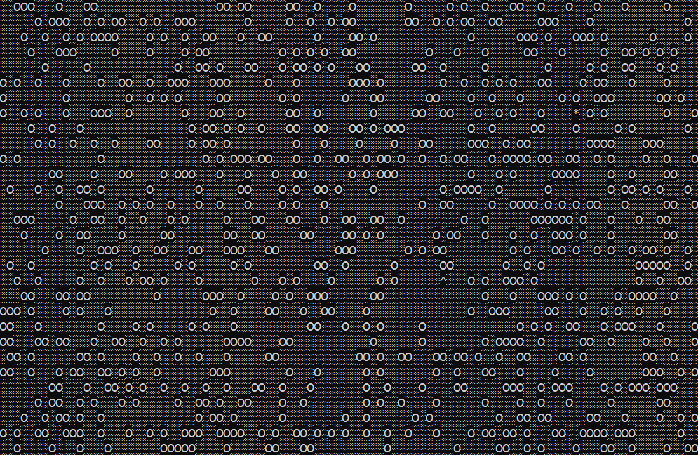

# findYourHat
> Interactive terminal game

## Table of contents
* [General info](#general-info)
* [Screenshots](#screenshots)
* [Technologies](#technologies)
* [Setup](#setup)
* [Features](#features)
* [Status](#status)
* [Inspiration](#inspiration)
* [Contact](#contact)

## General info
I was inspired to create this app as part of my full stack developer course on Codecademy.

## Screenshot

## Technologies
* Javascript
* Node.js

## Setup
An installation of Node.js is required to run the app, then simply open the main.js file in the terminal.

## Features
Features ready:
* A simplistic game whereby you have to find your hat from the given start position without falling down any holes.
* Difficulty selection.
* Game timer lets you know how quickly you solved the puzzle.
* Use the keyboard direction keys to move.

To-do list:
* Improve the interactivity and graphics.

## Status
Project is in progress.

## Contact
Created by [@joshuakent](josh.kent94@yahoo.co.uk) - feel free to contact me!